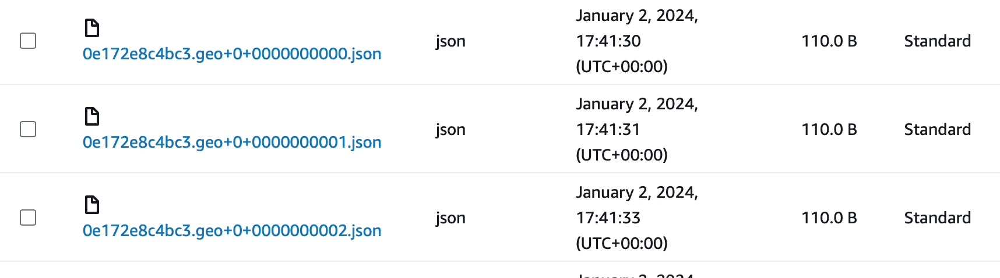
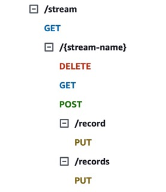
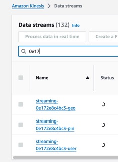
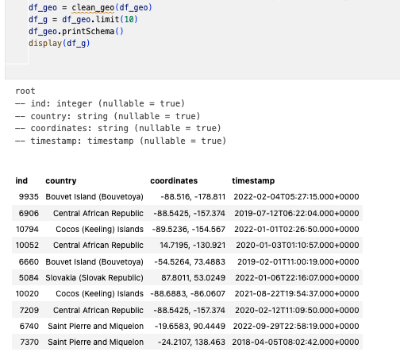
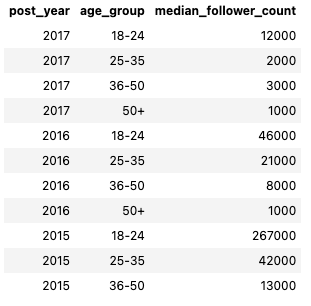
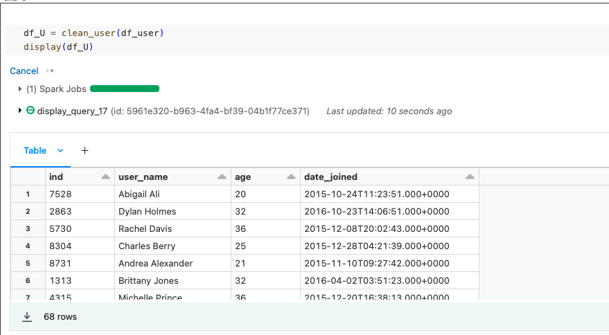
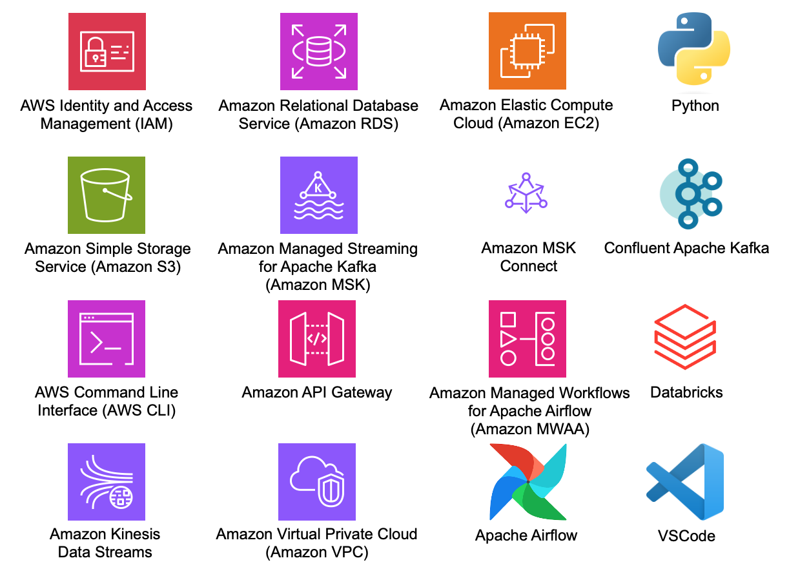

# Pinterest data pipeline

## Table of contents

1. [About this project](#about-this-project)
2. [Data](#data)
3. [Configuration](#configuration)
    1. [Batch Processing configuration](#batch-processing-configuration)
    2. [Streaming configuration](#streaming-configuration)
4. [Data processing](#data-processing)
    1. [Batch data processing](#batch-data-processing)
    2. [Streaming data processing](#streaming-data-processing)
5. [Cloning to your local device](#cloning-to-your-local-device)
6. [Other](#other)
    1. [Main tools](#main-tools)
    2. [Main files](#main-files)
    3. [Lisence](#lisence)

## About this project

Pinterest is the visual discovery engine where users can find ideas and inspiration in fashion, crafts, style, interior, creators and many other topics, personalised to their taste. From data perspective, Pinterest does everything from online data systems, to logging data, big data and stream processing platforms, analytics and more. It also is a massive ML machine generating recommendations for users home feed, search results, related productsand advertisement. Pinterest works with AWS for cloud infrastructure, Percona for MySQL support, along with a number of other companies.

**In this project**, two data piplines, similar to those which are used by Pinterest data engineers, were created. First one was built for **Batch Processing**, and used extract-load-transform (ELT) data integration processes. The second one was set up for **Data Streaming**, and differently to Batch Processing, implemented extract-transform-load (ETL) procedures. Various AWS tools (EC2, S3, MSK, API Gateway, etc) and Databricks platform were used to complete the project.

## Data

Cript (user_posting_emulation.py) provided for this project contains the login credentials for a RDS database, which contains three tables with data resembling data received by the Pinterest API when a POST request is made by a user uploading data to Pinterest:

    1. pinterest_data contains data about posts being updated to Pinterest
    2. geolocation_data contains data about the geolocation of each Pinterest post found in pinterest_data
    3. user_data contains data about the user that has uploaded each post found in pinterest_data

Running the provided script will print out pin_result, geo_result and user_result. These each represent one entry in their corresponding table. 

## Configuration 

Create AWS, GitHub and Databrics accounts.

### Batch Processing configuration

1. Set up an **AWS EC2 Kafka client machine**. This creates three topics which is necessary for data loading and storage in AWS S3 bucket. 

    - Connect to EC2 instance.
    - Install Kafka on EC2 instance.
    - Install the IAM MSK authentication package on your client EC2 machine.
    - Get necessary permissions to authenticate to the MSK cluster.
    - Configure your Kafka client to use AWS IAM authentication to the cluster.
    - Create Kafka topics:

            1. <your_UserId>.pin for the Pinterest posts data,
            2. <your_UserId>.geo for the post geolocation data,
            3. <your_UserId>.user for the post user data.

1. Connect an **AWS MSK cluster** to an **AWS S3 bucket**. **AWS MSK Connect** connects an MSK cluster to an S3 bucket, so that the data going through the cluster is saved and stored in a dedicated S3 bucket. 

    S3 bucket, an IAM role that allows you to write to this bucket or a VPC Endpoint to S3 have been already configured in the AWS account.

    - Download Confluent.io Amazon S3 Connector on the EC2 client.
    - Copy it to the bucket with your user id.
    - Create your custom plugin with the following name: <your_UserId>-plugin in the MSK Connect console.
    - Create a connector: <your_UserId>-connector, and choose the IAM role used for authentication to the MSK cluster in the Access permissions tab: <your_UserId>-ec2-access-role. 

    Now that the plugin-connector pair was built, data passing through the IAM authenticated cluster, will be automatically stored in the designated S3 bucket.

    

1. Configure HTTP API in **AWS API Gateway**. This API is meant for sending the data to MSK cluster, which then is stored in an S3 bucket. 

    API have already been created for the user. 

    - Build a Kafka REST Proxy integration, which provides a RESTful interface to a Kafka cluster: 
        - Create a resource that allows you to build an HTTP PROXY integration for your API in API Gateway console.
        - Create an HTTP ANY method for this resource. For Endpoint URL use Kafka Client Amazon EC2 Instance PublicDNS.
        - Deploy the API and make a note of the Invoke URL.

    - Set up Kafka REST proxy on the EC2 client: 
        - Install the Confluent package for the Kafka REST Proxy on your EC2 client machine. 
        - Allow the REST proxy to perform IAM authentication to the MSK cluster by modifying the kafka-rest.properties file.
        - Start the REST proxy on the EC2 client machine.

    - Send data to your API:
        - Modify the user_posting_emulation.py to send data from the three tables to their corresponding Kafka topics using your API Invoke URL.
        - Check if data is getting stored in the S3 bucket.
    
        

1. Mount an **AWS S3 bucket** to **Databricks platform**. Databricks is built upon Apache Spark, a powerful open-source distributed computing system that enables parallel processing of large datasets. 

    - Mount the desired S3 bucket to the Databricks account, so that the batch data could be cleaned and queries made.
    - Create  three DataFrames:

            1. df_pin for the Pinterest post data,
            2. df_geo for the geolocation data,
            3. df_user for the user data.

1. After data transformation, create and upload **DAG** to **AWS MWAA** environment.

    AWS account has been already been provided with access to a MWAA environment Databricks-Airflow-env and to its S3 bucket mwaa-dags-bucket. 

    - Create an Airflow DAG that will trigger a Databricks Notebook to be run on a daily schedule.
    - Upload it to the dags folder in the mwaa-dags-bucket.
    - Manually trigger the DAG and check if it runs successfully.

### Streaming configuration

1. Create data streams using **AWS Kinesis** Data Streams. Kinesis Data Streams is a serverless streaming data service that makes it easy to capture, process, and store data streams.

    - Using Kinesis Data Streams create three data streams, one for each Pinterest table.

1. Configure previously created REST API to allow it to invoke Kinesis actions. AWS account has been granted the necessary permissions to invoke Kinesis actions.

    

1. Send data to Kinesis streams. 

    - Create a new script user_posting_emulation_streaming.py, that builds upon the initial user_posting_emulation.py you have been provided with.
    - Modify the script so that it can send requests to your API, which adds one record at a time to the streams you have created. The data should be sent from the three Pinterest tables to their corresponding Kinesis stream.

        

1. Read data from Kinesis sreams to Databricks.

    - Create a new Notebook in Databricks and read in your credentials.
    - Run your preferred method to ingest data into Kinesis Data Streams. In the Kinesis console, check your data streams are receiving the data.
    - Read the data from the three streams you have created in your Databricks Notebook.

## Data processing

### Batch data processing

Data processing can take place once the S3 bucked has been mounted and the data has been read in to a DataFrame.  

1. **Data transformation**.

Clean posting, geolocation and user data. Use cleaning functions that are located in transformation_functions.py

2. **Data analysis**.

Answer queries:
    
- The most popular category in each country.
- The most popular category each year.
- User with the most fallowers in each country.
- The most popular category for different age groups.
- The median follower count for users based on age group.
- Users that have joined between 2015 and 2020.
- The median follower count of users that have joined between 2015 and 2020.
- The median follower count of users that have joined between 2015 and 2020, based on the age group they belong to.

### Streaming data processing

Streaming data processing can start once the connection has been made between Kinesis and Databricks, the data has been read and schema for each DataFrame has been defined.

1. **Data transformation**.

Clean posting, geolocation and user data. To ensure data is cleaned in the same way as in batch processing use the same cleaning functions that are located in transformation_functions.py. 

2. **Write the streaming data to Delta Tables**. Streaming data is not yet stored anywhere, so it needs a final storage location. 

## Cloning to your local device

The repository can be cloned by typing the following commands in the command line:

    git clone -c https://github.com/Egle-007/pinterest-data-pipeline273.git

## Other

### Main tools

### Main files

    pinterest-data-pipeline273/
    │  
    ├─ batch_processing/
    │  │
    │  ├─ user_posting_emulation_batch.py - Script that emulates Pinterest-like   
    │  │  experimental data and ingests it into MSK through POST requests
    │  │
    │  ├─ Mount-S3-to-Databricks.ipynb - Notebook with batch data processing
    │  │   
    │  └─ 0e172e8c4bc3_dag.py - The Airflow DAG file for sheduled run of 
    │     Databricks notebook
    │     
    ├─ pictures - All pictures user in this README.md file
    │     
    ├─ streaming/
    │  │
    │  ├─ Streaming-kinesis.ipynb - Notebook with streaming data processing
    │  │
    │  └─ user_posting_emulation_streaming.py - Script that emulates Pinterest-like   
    │     experimental data and ingests it into Kinesis through PUT requests
    │      
    ├─ .gitignore - files that should not be tracked
    │
    ├─ transformation_functions.ipynb - functions used in data cleaning
    │   │      
    ├─ user_posting_emulation_batch.py - provided script for Pinterest_like data
    │
    └─ README.md

### Lisence

    This project is licensed under the MIT lisence.

Copyright (c) 2023 pinterest-data-pipeline273

Permission is hereby granted, free of charge, to any person obtaining a copy of this software and associated documentation files (the "Software"), to deal in the Software without restriction, including without limitation the rights to use, copy, modify, merge, publish, distribute, sublicense, and/or sell copies of the Software, and to permit persons to whom the Software is furnished to do so, subject to the following conditions:

The above copyright notice and this permission notice shall be included in all copies or substantial portions of the Software.

THE SOFTWARE IS PROVIDED "AS IS"WITHOUT WARRANTY OF ANY KIND, EXPRESS OR IMPLIED, INCLUDING BUT NOT LIMITED TO THE WARRANTIES OF MERCHANTABILITY, FITNESS FOR A PARTICULAR PURPOSE AND NONINFRINGEMENT. IN NO EVENT SHALL THE AUTHORS OR COPYRIGHT HOLDERS BE LIABLE FOR ANY CLAIM, DAMAGES OR OTHER LIABILITY, WHETHER IN AN ACTION OF CONTRACT, TORT OR OTHERWISE, ARISING FROM, OUT OF OR IN CONNECTION WITH THE SOFTWARE OR THE USE OR OTHER DEALINGS IN THE SOFTWARE.